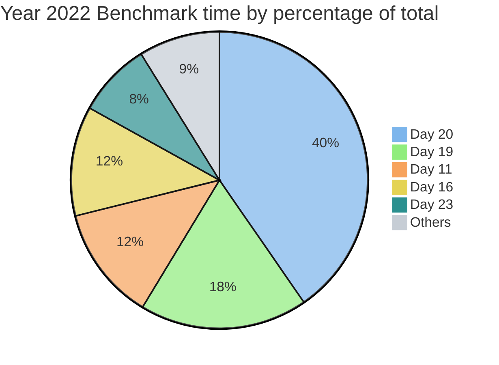

# Advent of Code

 

Complete 2022 entries for the annual [Advent of Code](https://adventofcode.com/) challenge, written in performant Rust.

Solutions depend only on the stable Rust Standard Library. The code tries it's best to stay clean and elegant, but the focus is on speed so if bit twiddling or mashing stuff into an array makes things faster, then all scruples are jettisoned!

Benchmarks are measured using the built-in `cargo bench` tool run on an Apple M2 Max. All 25 solutions from 2022 complete sequentially in **19 milliseconds**. Performance is reasonable even on older hardware, for example a 2011 MacBook Pro with an [Intel i7-2720QM](https://ark.intel.com/content/www/us/en/ark/products/50067/intel-core-i72720qm-processor-6m-cache-up-to-3-30-ghz.html) processor takes 60 milliseconds to run the solutions.

The project is structured as a library crate with a module per year and a sub-module for each day to allow convenient testing and benchmarking. Continuous integration is provided using [GitHub Actions](https://docs.github.com/en/actions) with 100% test coverage based on the example inputs from each day.

Each solution is thoroughly commented to help explain the approach, browse the source or checkout the online [rustdocs](https://maneatingape.github.io/advent-of-code-rust/aoc/).

## Cargo commands

**Run**
* Everything as debug (slow) `cargo run`
* Everything as release (fast) `cargo run --release`
* Optimized for current CPU architecture `RUSTFLAGS="-C target-cpu=native" cargo run --release`
* Specific year `cargo run -- --year 2022`
* Specific day `cargo run -- --year 2022 --day 01`

**Test**
* Everything `cargo test`
* Show STDOUT for debugging `cargo test -- --nocapture`
* Specific year `cargo test year2022`
* Specific day `cargo test year2022::day01`

**Benchmark**
* Everything `cargo bench`
* Specific year `cargo bench year2022`
* Specific day `cargo bench year2022_day01`

**Document**
* Build docs including private items `cargo doc --document-private-items`
* Build doc then open HTML landing page `cargo doc --document-private-items --open`

**Miscellaneous**
* Code quality lints `cargo clippy`
* Consistent code formatting `cargo fmt`

## Years

* [2022](#2022) (18.6 ± 0.3 ms total benchmark)
* [2021](#2021) (in progress)
* [2015](#2015)

## 2022

| Day | Problem | Solution | Benchmark (μs) |
| --- | --- | --- | --: |
| 1 | [Calorie Counting](https://adventofcode.com/2022/day/1) | [Source](src/year2022/day01.rs) | 30 |
| 2 | [Rock Paper Scissors](https://adventofcode.com/2022/day/2) | [Source](src/year2022/day02.rs) | 8 |
| 3 | [Rucksack Reorganization](https://adventofcode.com/2022/day/3) | [Source](src/year2022/day03.rs) | 15 |
| 4 | [Camp Cleanup](https://adventofcode.com/2022/day/4) | [Source](src/year2022/day04.rs) | 47 |
| 5 | [Supply Stacks](https://adventofcode.com/2022/day/5) | [Source](src/year2022/day05.rs) | 36 |
| 6 | [Tuning Trouble](https://adventofcode.com/2022/day/6) | [Source](src/year2022/day06.rs) | 5 |
| 7 | [No Space Left On Device](https://adventofcode.com/2022/day/7) | [Source](src/year2022/day07.rs) | 11 |
| 8 | [Treetop Tree House](https://adventofcode.com/2022/day/8) | [Source](src/year2022/day08.rs) | 57 |
| 9 | [Rope Bridge](https://adventofcode.com/2022/day/9) | [Source](src/year2022/day09.rs) | 244 |
| 10 | [Cathode-Ray Tube](https://adventofcode.com/2022/day/10) | [Source](src/year2022/day10.rs) | 1 |
| 11 | [Monkey in the Middle](https://adventofcode.com/2022/day/11) | [Source](src/year2022/day11.rs) | 2321 |
| 12 | [Hill Climbing Algorithm](https://adventofcode.com/2022/day/12) | [Source](src/year2022/day12.rs) | 51 |
| 13 | [Distress Signal](https://adventofcode.com/2022/day/13) | [Source](src/year2022/day13.rs) | 53 |
| 14 | [Regolith Reservoir](https://adventofcode.com/2022/day/14) | [Source](src/year2022/day14.rs) | 299 |
| 15 | [Beacon Exclusion Zone](https://adventofcode.com/2022/day/15) | [Source](src/year2022/day15.rs) | 6 |
| 16 | [Proboscidea Volcanium](https://adventofcode.com/2022/day/16) | [Source](src/year2022/day16.rs) | 2228 |
| 17 | [Pyroclastic Flow](https://adventofcode.com/2022/day/17) | [Source](src/year2022/day17.rs) | 70 |
| 18 | [Boiling Boulders](https://adventofcode.com/2022/day/18) | [Source](src/year2022/day18.rs) | 181 |
| 19 | [Not Enough Minerals](https://adventofcode.com/2022/day/19) | [Source](src/year2022/day19.rs) | 3413 |
| 20 | [Grove Positioning System](https://adventofcode.com/2022/day/20) | [Source](src/year2022/day20.rs) | 7485 |
| 21 | [Monkey Math](https://adventofcode.com/2022/day/21) | [Source](src/year2022/day21.rs) | 140 |
| 22 | [Monkey Map](https://adventofcode.com/2022/day/22) | [Source](src/year2022/day22.rs) | 127 |
| 23 | [Unstable Diffusion](https://adventofcode.com/2022/day/23) | [Source](src/year2022/day23.rs) | 1502 |
| 24 | [Blizzard Basin](https://adventofcode.com/2022/day/24) | [Source](src/year2022/day24.rs) | 82 |
| 25 | [Full of Hot Air](https://adventofcode.com/2022/day/25) | [Source](src/year2022/day25.rs) | 3 |

## 2021

| Day | Problem | Solution | Benchmark (μs) |
| --- | --- | --- | --: |
| 1 | [Sonar Sweep](https://adventofcode.com/2021/day/1) | [Source](src/year2021/day01.rs) | 22 |
| 2 | [Dive!](https://adventofcode.com/2021/day/2) | [Source](src/year2021/day02.rs) | 15 |
| 3 | [Binary Diagnostic](https://adventofcode.com/2021/day/3) | [Source](src/year2021/day03.rs) | 20 |
| 4 | [Giant Squid](https://adventofcode.com/2021/day/4) | [Source](src/year2021/day04.rs) | 45 |
| 5 | [Hydrothermal Venture](https://adventofcode.com/2021/day/5) | [Source](src/year2021/day05.rs) | 202 |
| 6 | [Lanternfish](https://adventofcode.com/2021/day/6) | [Source](src/year2021/day06.rs) | 2 |
| 7 | [The Treachery of Whales](https://adventofcode.com/2021/day/7) | [Source](src/year2021/day07.rs) | 19 |
| 8 | [Seven Segment Search](https://adventofcode.com/2021/day/8) | [Source](src/year2021/day08.rs) | 21 |
| 9 | [Smoke Basin](https://adventofcode.com/2021/day/9) | [Source](src/year2021/day09.rs) | 80 |
| 10 | [Syntax Scoring](https://adventofcode.com/2021/day/10) | [Source](src/year2021/day10.rs) | 35 |
| 11 | [Dumbo Octopus](https://adventofcode.com/2021/day/11) | [Source](src/year2021/day11.rs) | 217 |
| 12 | [Passage Pathing](https://adventofcode.com/2021/day/12) | [Source](src/year2021/day12.rs) | 261 |
| 13 | [Transparent Origami](https://adventofcode.com/2021/day/13) | [Source](src/year2021/day13.rs) | 40 |
| 14 | [Extended Polymerization](https://adventofcode.com/2021/day/14) | [Source](src/year2021/day14.rs) | 12 |
| 15 | [Chiton](https://adventofcode.com/2021/day/15) | [Source](src/year2021/day15.rs) | 5700 |
| 16 | [Packet Decoder](https://adventofcode.com/2021/day/16) | [Source](src/year2021/day16.rs) | 6 |
| 17 | [Trick Shot](https://adventofcode.com/2021/day/17) | [Source](src/year2021/day17.rs) | 8 |
| 18 | [Snailfish](https://adventofcode.com/2021/day/18) | [Source](src/year2021/day18.rs) | 1904 |
| 19 | [Beacon Scanner](https://adventofcode.com/2021/day/19) | [Source](src/year2021/day19.rs) | 933 |
| 20 | [Trench Map](https://adventofcode.com/2021/day/20) | [Source](src/year2021/day20.rs) | 2072 |
| 21 | [Dirac Dice](https://adventofcode.com/2021/day/21) | [Source](src/year2021/day21.rs) | 1042 |
| 22 | [Reactor Reboot](https://adventofcode.com/2021/day/22) | [Source](src/year2021/day22.rs) | 414 |

## 2015

| Day | Problem | Solution |
| --- | --- | --- |
| 1 | [Not Quite Lisp](https://adventofcode.com/2015/day/1) | [Source](src/year2015/day01.rs) |
| 2 | [I Was Told There Would Be No Math](https://adventofcode.com/2015/day/2) | [Source](src/year2015/day02.rs) |
| 3 | [Perfectly Spherical Houses in a Vacuum](https://adventofcode.com/2015/day/3) | [Source](src/year2015/day03.rs) |
| 4 | [The Ideal Stocking Stuffer](https://adventofcode.com/2015/day/4) | [Source](src/year2015/day04.rs) |
| 5 | [Doesn't He Have Intern-Elves For This?](https://adventofcode.com/2015/day/5) | [Source](src/year2015/day05.rs) |
