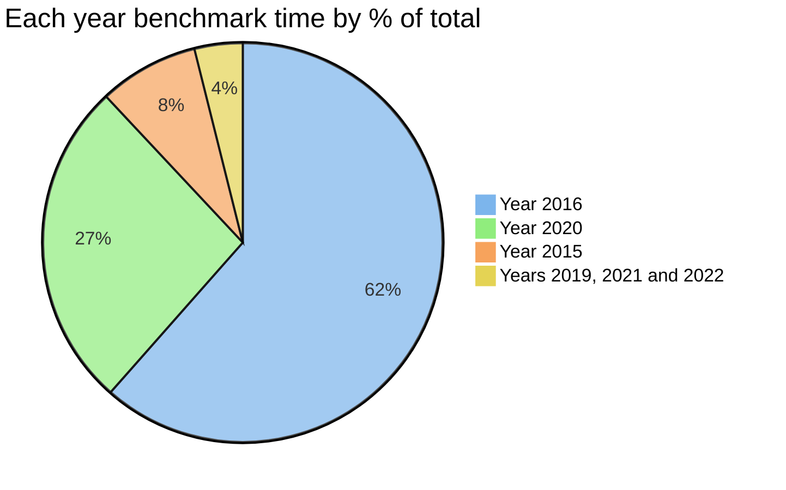
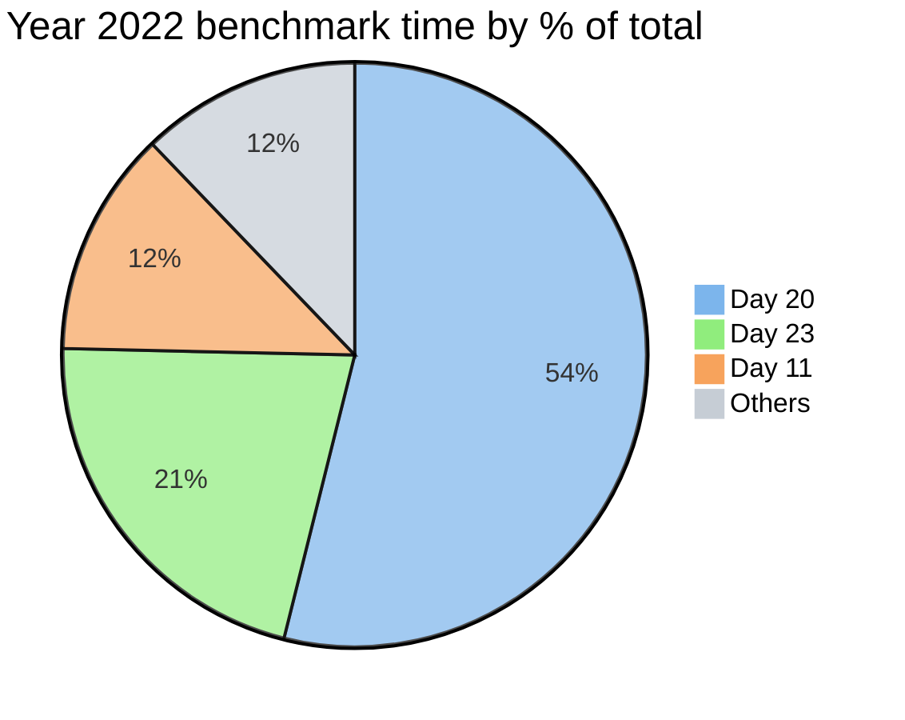
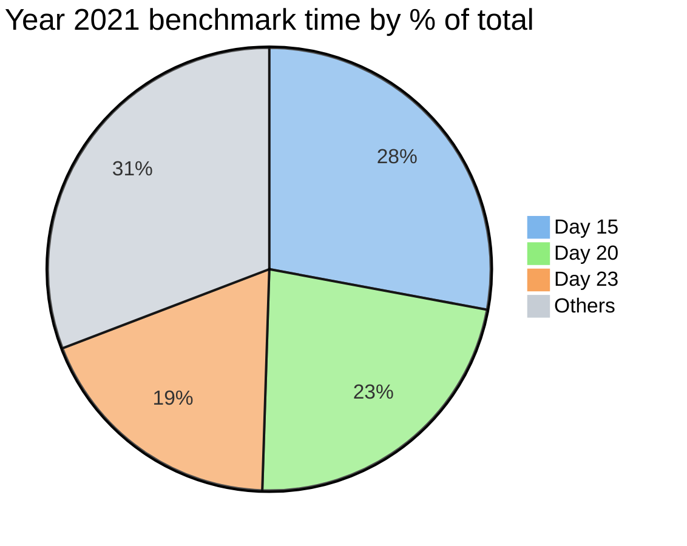
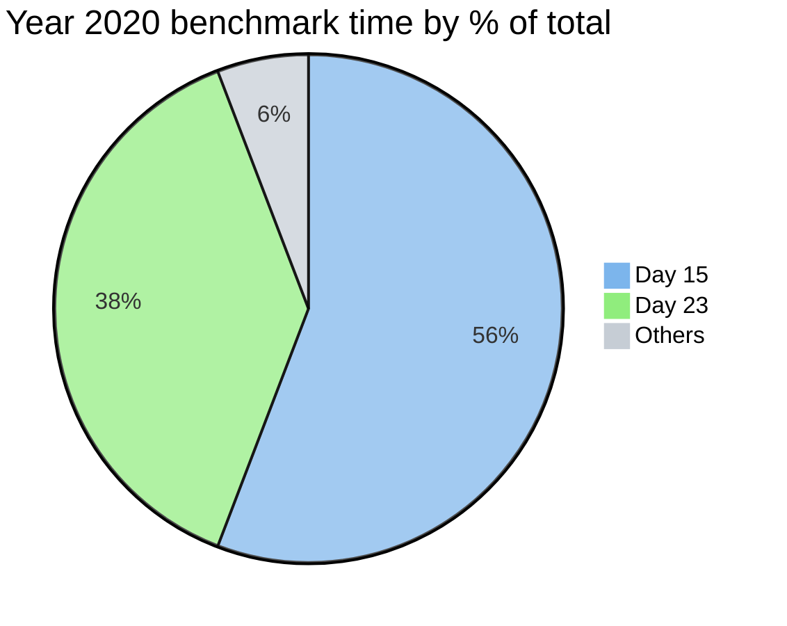
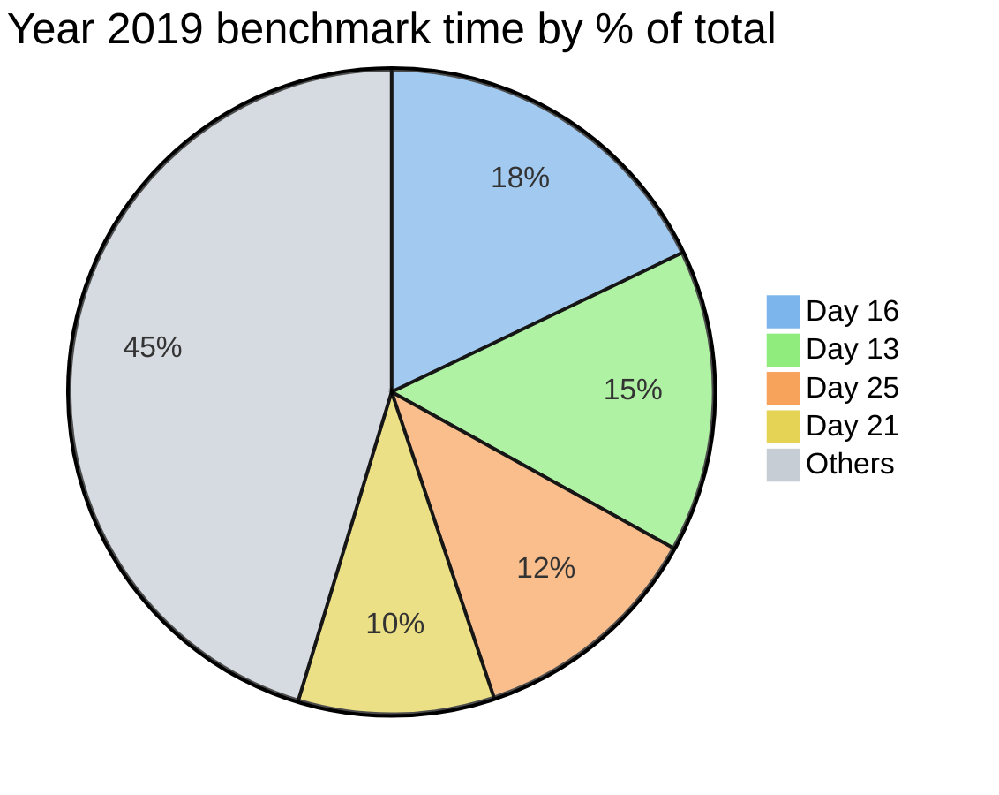
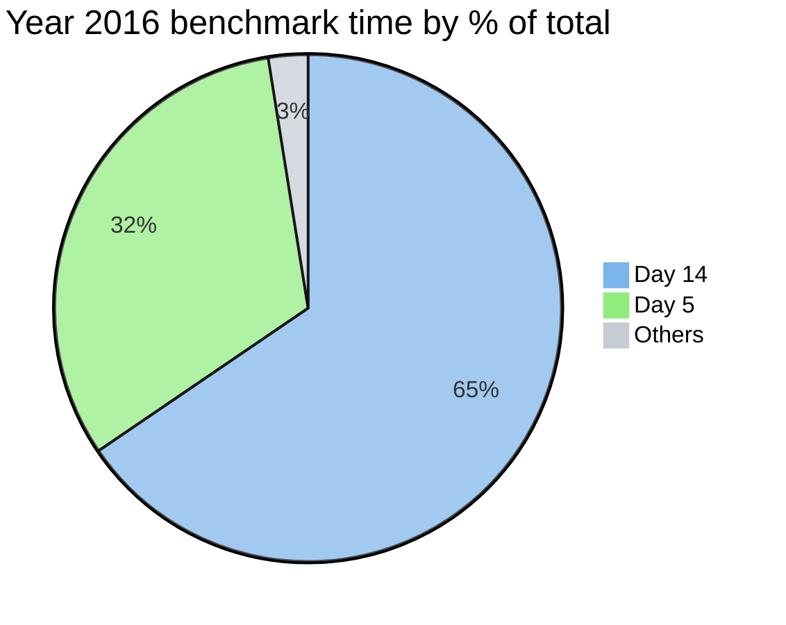
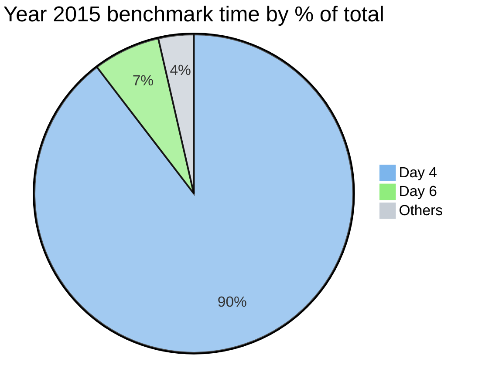

# Advent of Code [![checks-badge]][checks-link] [![docs-badge]][docs-link]

[checks-badge]: https://img.shields.io/github/actions/workflow/status/maneatingape/advent-of-code-rust/checks.yml?label=checks
[checks-link]: https://github.com/maneatingape/advent-of-code-rust/actions/workflows/checks.yml
[docs-badge]: https://img.shields.io/github/actions/workflow/status/maneatingape/advent-of-code-rust/docs.yml?color=blue&label=docs
[docs-link]: https://maneatingape.github.io/advent-of-code-rust/aoc/

Complete 2022 to 2019 and 2016 to 2015 entries for the annual [Advent of Code](https://adventofcode.com/) challenge, written in performant Rust.

## Features

* Each solution is blazing fast, using the most efficient algorithms to the best of my knowledge.
* Clean, elegant and idiomatic code.
* Consistently formatted with `rustfmt` and linted by `clippy`.
* Thoroughly commented with `rustdoc` generated [documentation online][docs-link].
* Test coverage with continuous integration provided by [GitHub Actions][checks-link].
* Self contained depending only on the stable `std` Rust library. No use of `unsafe` features.

## Quickstart

Show details

**Run**
* Everything `cargo run`
* Specific year `cargo run year2022`
* Specific day `cargo run year2022::day01`
* Release profile (faster) `cargo run --release`
* Optimized for current CPU architecture (fastest) `RUSTFLAGS="-C target-cpu=native" cargo run --release`

**Test**
* Everything `cargo test`
* Specific year `cargo test year2022`
* Specific day `cargo test year2022::day01`
* Show STDOUT for debugging `cargo test -- --nocapture`

**Benchmark**
* Everything `cargo bench`
* Specific year `cargo bench year2022`
* Specific day `cargo bench year2022::day01`

**Document**
* Build docs including private items `cargo doc --document-private-items`
* Build doc then open HTML landing page `cargo doc --document-private-items --open`

**Miscellaneous**
* Code quality lints `cargo clippy`
* Consistent code formatting `cargo fmt`

## Performance

Benchmarks are measured using the built-in `cargo bench` tool run on an Apple M2 Max.
All 150 solutions from 2022 to 2019 and also 2016 to 2015 complete sequentially in **1.1 seconds**.
Interestingly 93% of the total time is spent on just 6 solutions.
Performance is reasonable even on older hardware, for example a 2011 MacBook Pro with an
[Intel i7-2720QM](https://ark.intel.com/content/www/us/en/ark/products/50067/intel-core-i72720qm-processor-6m-cache-up-to-3-30-ghz.html)
processor takes 4.4 seconds to run the same 150 solutions.

* [2022](#2022) (10 ms)
* [2021](#2021) (10 ms)
* [2020](#2020) (286 ms)
* [2019](#2019) (22 ms)
* [2017](#2017) (in progress)
* [2016](#2016) (663 ms)
* [2015](#2015) (87 ms)

## 2022

| Day | Problem | Solution | Benchmark (μs) |
| --- | --- | --- | --: |
| 1 | [Calorie Counting](https://adventofcode.com/2022/day/1) | [Source](src/year2022/day01.rs) | 14 |
| 2 | [Rock Paper Scissors](https://adventofcode.com/2022/day/2) | [Source](src/year2022/day02.rs) | 4 |
| 3 | [Rucksack Reorganization](https://adventofcode.com/2022/day/3) | [Source](src/year2022/day03.rs) | 15 |
| 4 | [Camp Cleanup](https://adventofcode.com/2022/day/4) | [Source](src/year2022/day04.rs) | 7 |
| 5 | [Supply Stacks](https://adventofcode.com/2022/day/5) | [Source](src/year2022/day05.rs) | 14 |
| 6 | [Tuning Trouble](https://adventofcode.com/2022/day/6) | [Source](src/year2022/day06.rs) | 3 |
| 7 | [No Space Left On Device](https://adventofcode.com/2022/day/7) | [Source](src/year2022/day07.rs) | 10 |
| 8 | [Treetop Tree House](https://adventofcode.com/2022/day/8) | [Source](src/year2022/day08.rs) | 55 |
| 9 | [Rope Bridge](https://adventofcode.com/2022/day/9) | [Source](src/year2022/day09.rs) | 122 |
| 10 | [Cathode-Ray Tube](https://adventofcode.com/2022/day/10) | [Source](src/year2022/day10.rs) | 2 |
| 11 | [Monkey in the Middle](https://adventofcode.com/2022/day/11) | [Source](src/year2022/day11.rs) | 1172 |
| 12 | [Hill Climbing Algorithm](https://adventofcode.com/2022/day/12) | [Source](src/year2022/day12.rs) | 59 |
| 13 | [Distress Signal](https://adventofcode.com/2022/day/13) | [Source](src/year2022/day13.rs) | 16 |
| 14 | [Regolith Reservoir](https://adventofcode.com/2022/day/14) | [Source](src/year2022/day14.rs) | 205 |
| 15 | [Beacon Exclusion Zone](https://adventofcode.com/2022/day/15) | [Source](src/year2022/day15.rs) | 2 |
| 16 | [Proboscidea Volcanium](https://adventofcode.com/2022/day/16) | [Source](src/year2022/day16.rs) | 60 |
| 17 | [Pyroclastic Flow](https://adventofcode.com/2022/day/17) | [Source](src/year2022/day17.rs) | 68 |
| 18 | [Boiling Boulders](https://adventofcode.com/2022/day/18) | [Source](src/year2022/day18.rs) | 129 |
| 19 | [Not Enough Minerals](https://adventofcode.com/2022/day/19) | [Source](src/year2022/day19.rs) | 71 |
| 20 | [Grove Positioning System](https://adventofcode.com/2022/day/20) | [Source](src/year2022/day20.rs) | 5067 |
| 21 | [Monkey Math](https://adventofcode.com/2022/day/21) | [Source](src/year2022/day21.rs) | 61 |
| 22 | [Monkey Map](https://adventofcode.com/2022/day/22) | [Source](src/year2022/day22.rs) | 55 |
| 23 | [Unstable Diffusion](https://adventofcode.com/2022/day/23) | [Source](src/year2022/day23.rs) | 2017 |
| 24 | [Blizzard Basin](https://adventofcode.com/2022/day/24) | [Source](src/year2022/day24.rs) | 80 |
| 25 | [Full of Hot Air](https://adventofcode.com/2022/day/25) | [Source](src/year2022/day25.rs) | 3 |

## 2021

| Day | Problem | Solution | Benchmark (μs) |
| --- | --- | --- | --: |
| 1 | [Sonar Sweep](https://adventofcode.com/2021/day/1) | [Source](src/year2021/day01.rs) | 6 |
| 2 | [Dive!](https://adventofcode.com/2021/day/2) | [Source](src/year2021/day02.rs) | 11 |
| 3 | [Binary Diagnostic](https://adventofcode.com/2021/day/3) | [Source](src/year2021/day03.rs) | 20 |
| 4 | [Giant Squid](https://adventofcode.com/2021/day/4) | [Source](src/year2021/day04.rs) | 11 |
| 5 | [Hydrothermal Venture](https://adventofcode.com/2021/day/5) | [Source](src/year2021/day05.rs) | 179 |
| 6 | [Lanternfish](https://adventofcode.com/2021/day/6) | [Source](src/year2021/day06.rs) | 1 |
| 7 | [The Treachery of Whales](https://adventofcode.com/2021/day/7) | [Source](src/year2021/day07.rs) | 1 |
| 8 | [Seven Segment Search](https://adventofcode.com/2021/day/8) | [Source](src/year2021/day08.rs) | 16 |
| 9 | [Smoke Basin](https://adventofcode.com/2021/day/9) | [Source](src/year2021/day09.rs) | 55 |
| 10 | [Syntax Scoring](https://adventofcode.com/2021/day/10) | [Source](src/year2021/day10.rs) | 33 |
| 11 | [Dumbo Octopus](https://adventofcode.com/2021/day/11) | [Source](src/year2021/day11.rs) | 58 |
| 12 | [Passage Pathing](https://adventofcode.com/2021/day/12) | [Source](src/year2021/day12.rs) | 27 |
| 13 | [Transparent Origami](https://adventofcode.com/2021/day/13) | [Source](src/year2021/day13.rs) | 32 |
| 14 | [Extended Polymerization](https://adventofcode.com/2021/day/14) | [Source](src/year2021/day14.rs) | 12 |
| 15 | [Chiton](https://adventofcode.com/2021/day/15) | [Source](src/year2021/day15.rs) | 2567 |
| 16 | [Packet Decoder](https://adventofcode.com/2021/day/16) | [Source](src/year2021/day16.rs) | 5 |
| 17 | [Trick Shot](https://adventofcode.com/2021/day/17) | [Source](src/year2021/day17.rs) | 7 |
| 18 | [Snailfish](https://adventofcode.com/2021/day/18) | [Source](src/year2021/day18.rs) | 461 |
| 19 | [Beacon Scanner](https://adventofcode.com/2021/day/19) | [Source](src/year2021/day19.rs) | 554 |
| 20 | [Trench Map](https://adventofcode.com/2021/day/20) | [Source](src/year2021/day20.rs) | 2075 |
| 21 | [Dirac Dice](https://adventofcode.com/2021/day/21) | [Source](src/year2021/day21.rs) | 282 |
| 22 | [Reactor Reboot](https://adventofcode.com/2021/day/22) | [Source](src/year2021/day22.rs) | 398 |
| 23 | [Amphipod](https://adventofcode.com/2021/day/23) | [Source](src/year2021/day23.rs) | 1717 |
| 24 | [Arithmetic Logic Unit](https://adventofcode.com/2021/day/24) | [Source](src/year2021/day24.rs) | 4 |
| 25 | [Sea Cucumber](https://adventofcode.com/2021/day/25) | [Source](src/year2021/day25.rs) | 621 |

## 2020

| Day | Problem | Solution | Benchmark (μs) |
| --- | --- | --- | --: |
| 1 | [Report Repair](https://adventofcode.com/2020/day/1) | [Source](src/year2020/day01.rs) | 11 |
| 2 | [Password Philosophy](https://adventofcode.com/2020/day/2) | [Source](src/year2020/day02.rs) | 35 |
| 3 | [Toboggan Trajectory](https://adventofcode.com/2020/day/3) | [Source](src/year2020/day03.rs) | 11 |
| 4 | [Passport Processing](https://adventofcode.com/2020/day/4) | [Source](src/year2020/day04.rs) | 43 |
| 5 | [Binary Boarding](https://adventofcode.com/2020/day/5) | [Source](src/year2020/day05.rs) | 12 |
| 6 | [Custom Customs](https://adventofcode.com/2020/day/6) | [Source](src/year2020/day06.rs) | 35 |
| 7 | [Handy Haversacks](https://adventofcode.com/2020/day/7) | [Source](src/year2020/day07.rs) | 55 |
| 8 | [Handheld Halting](https://adventofcode.com/2020/day/8) | [Source](src/year2020/day08.rs) | 7 |
| 9 | [Encoding Error](https://adventofcode.com/2020/day/9) | [Source](src/year2020/day09.rs) | 9 |
| 10 | [Adapter Array](https://adventofcode.com/2020/day/10) | [Source](src/year2020/day10.rs) | 1 |
| 11 | [Seating System](https://adventofcode.com/2020/day/11) | [Source](src/year2020/day11.rs) | 4847 |
| 12 | [Rain Risk](https://adventofcode.com/2020/day/12) | [Source](src/year2020/day12.rs) | 11 |
| 13 | [Shuttle Search](https://adventofcode.com/2020/day/13) | [Source](src/year2020/day13.rs) | 1 |
| 14 | [Docking Data](https://adventofcode.com/2020/day/14) | [Source](src/year2020/day14.rs) | 79 |
| 15 | [Rambunctious Recitation](https://adventofcode.com/2020/day/15) | [Source](src/year2020/day15.rs) | 160000 |
| 16 | [Ticket Translation](https://adventofcode.com/2020/day/16) | [Source](src/year2020/day16.rs) | 102 |
| 17 | [Conway Cubes](https://adventofcode.com/2020/day/17) | [Source](src/year2020/day17.rs) | 414 |
| 18 | [Operation Order](https://adventofcode.com/2020/day/18) | [Source](src/year2020/day18.rs) | 26 |
| 19 | [Monster Messages](https://adventofcode.com/2020/day/19) | [Source](src/year2020/day19.rs) | 384 |
| 20 | [Jurassic Jigsaw](https://adventofcode.com/2020/day/20) | [Source](src/year2020/day20.rs) | 38 |
| 21 | [Allergen Assessment](https://adventofcode.com/2020/day/21) | [Source](src/year2020/day21.rs) | 51 |
| 22 | [Crab Combat](https://adventofcode.com/2020/day/22) | [Source](src/year2020/day22.rs) | 6105 |
| 23 | [Crab Cups](https://adventofcode.com/2020/day/23) | [Source](src/year2020/day23.rs) | 110000 |
| 24 | [Lobby Layout](https://adventofcode.com/2020/day/24) | [Source](src/year2020/day24.rs) | 4346 |
| 25 | [Combo Breaker](https://adventofcode.com/2020/day/25) | [Source](src/year2020/day25.rs) | 24 |

## 2019

| Day | Problem | Solution | Benchmark (μs) |
| --- | --- | --- | --: |
| 1 | [The Tyranny of the Rocket Equation](https://adventofcode.com/2019/day/1) | [Source](src/year2019/day01.rs) | 1 |
| 2 | [1202 Program Alarm](https://adventofcode.com/2019/day/2) | [Source](src/year2019/day02.rs) | 1 |
| 3 | [Crossed Wires](https://adventofcode.com/2019/day/3) | [Source](src/year2019/day03.rs) | 19 |
| 4 | [Secure Container](https://adventofcode.com/2019/day/4) | [Source](src/year2019/day04.rs) | 7 |
| 5 | [Sunny with a Chance of Asteroids](https://adventofcode.com/2019/day/5) | [Source](src/year2019/day05.rs) | 3 |
| 6 | [Universal Orbit Map](https://adventofcode.com/2019/day/6) | [Source](src/year2019/day06.rs) | 28 |
| 7 | [Amplification Circuit](https://adventofcode.com/2019/day/7) | [Source](src/year2019/day07.rs) | 275 |
| 8 | [Space Image Format](https://adventofcode.com/2019/day/8) | [Source](src/year2019/day08.rs) | 5 |
| 9 | [Sensor Boost](https://adventofcode.com/2019/day/9) | [Source](src/year2019/day09.rs) | 1356 |
| 10 | [Monitoring Station](https://adventofcode.com/2019/day/10) | [Source](src/year2019/day10.rs) | 1001 |
| 11 | [Space Police](https://adventofcode.com/2019/day/11) | [Source](src/year2019/day11.rs) | 470 |
| 12 | [The N-Body Problem](https://adventofcode.com/2019/day/12) | [Source](src/year2019/day12.rs) | 1024 |
| 13 | [Care Package](https://adventofcode.com/2019/day/13) | [Source](src/year2019/day13.rs) | 3492 |
| 14 | [Space Stoichiometry](https://adventofcode.com/2019/day/14) | [Source](src/year2019/day14.rs) | 17 |
| 15 | [Oxygen System](https://adventofcode.com/2019/day/15) | [Source](src/year2019/day15.rs) | 442 |
| 16 | [Flawed Frequency Transmission](https://adventofcode.com/2019/day/16) | [Source](src/year2019/day16.rs) | 4124 |
| 17 | [Set and Forget](https://adventofcode.com/2019/day/17) | [Source](src/year2019/day17.rs) | 425 |
| 18 | [Many-Worlds Interpretation](https://adventofcode.com/2019/day/18) | [Source](src/year2019/day18.rs) | 1077 |
| 19 | [Tractor Beam](https://adventofcode.com/2019/day/19) | [Source](src/year2019/day19.rs) | 817 |
| 20 | [Donut Maze](https://adventofcode.com/2019/day/20) | [Source](src/year2019/day20.rs) | 191 |
| 21 | [Springdroid Adventure](https://adventofcode.com/2019/day/21) | [Source](src/year2019/day21.rs) | 2265 |
| 22 | [Slam Shuffle](https://adventofcode.com/2019/day/22) | [Source](src/year2019/day22.rs) | 11 |
| 23 | [Category Six](https://adventofcode.com/2019/day/23) | [Source](src/year2019/day23.rs) | 871 |
| 24 | [Planet of Discord](https://adventofcode.com/2019/day/24) | [Source](src/year2019/day24.rs) | 139 |
| 25 | [Cryostasis](https://adventofcode.com/2019/day/25) | [Source](src/year2019/day25.rs) | 2721 |

## 2017

| Day | Problem | Solution | Benchmark (μs) |
| --- | --- | --- | --: |
| 1 | [Inverse Captcha](https://adventofcode.com/2017/day/1) | [Source](src/year2017/day01.rs) | 1 |
| 2 | [Corruption Checksum](https://adventofcode.com/2017/day/2) | [Source](src/year2017/day02.rs) | 3 |
| 3 | [Spiral Memory](https://adventofcode.com/2017/day/3) | [Source](src/year2017/day03.rs) | 2 |
| 4 | [High-Entropy Passphrases](https://adventofcode.com/2017/day/4) | [Source](src/year2017/day04.rs) | 94 |
| 5 | [A Maze of Twisty Trampolines, All Alike](https://adventofcode.com/2017/day/5) | [Source](src/year2017/day05.rs) | 48000 |
| 6 | [Memory Reallocation](https://adventofcode.com/2017/day/6) | [Source](src/year2017/day06.rs) | 81 |
| 7 | [Recursive Circus](https://adventofcode.com/2017/day/7) | [Source](src/year2017/day07.rs) | 85 |
| 8 | [I Heard You Like Registers](https://adventofcode.com/2017/day/8) | [Source](src/year2017/day08.rs) | 46 |
| 9 | [Stream Processing](https://adventofcode.com/2017/day/9) | [Source](src/year2017/day09.rs) | 13 |
| 10 | [Knot Hash](https://adventofcode.com/2017/day/10) | [Source](src/year2017/day10.rs) | 112 |
| 11 | [Hex Ed](https://adventofcode.com/2017/day/11) | [Source](src/year2017/day11.rs) | 20 |
| 12 | [Digital Plumber](https://adventofcode.com/2017/day/12) | [Source](src/year2017/day12.rs) | 59 |

## 2016

| Day | Problem | Solution | Benchmark (μs) |
| --- | --- | --- | --: |
| 1 | [No Time for a Taxicab](https://adventofcode.com/2016/day/1) | [Source](src/year2016/day01.rs) | 3 |
| 2 | [Bathroom Security](https://adventofcode.com/2016/day/2) | [Source](src/year2016/day02.rs) | 9 |
| 3 | [Squares With Three Sides](https://adventofcode.com/2016/day/3) | [Source](src/year2016/day03.rs) | 26 |
| 4 | [Security Through Obscurity](https://adventofcode.com/2016/day/4) | [Source](src/year2016/day04.rs) | 75 |
| 5 | [How About a Nice Game of Chess?](https://adventofcode.com/2016/day/5) | [Source](src/year2016/day05.rs) | 212000 |
| 6 | [Signals and Noise](https://adventofcode.com/2016/day/6) | [Source](src/year2016/day06.rs) | 5 |
| 7 | [Internet Protocol Version 7](https://adventofcode.com/2016/day/7) | [Source](src/year2016/day07.rs) | 354 |
| 8 | [Two-Factor Authentication](https://adventofcode.com/2016/day/8) | [Source](src/year2016/day08.rs) | 10 |
| 9 | [Explosives in Cyberspace](https://adventofcode.com/2016/day/9) | [Source](src/year2016/day09.rs) | 6 |
| 10 | [Balance Bots](https://adventofcode.com/2016/day/10) | [Source](src/year2016/day10.rs) | 17 |
| 11 | [Radioisotope Thermoelectric Generators](https://adventofcode.com/2016/day/11) | [Source](src/year2016/day11.rs) | 785 |
| 12 | [Leonardo's Monorail](https://adventofcode.com/2016/day/12) | [Source](src/year2016/day12.rs) | 1 |
| 13 | [A Maze of Twisty Little Cubicles](https://adventofcode.com/2016/day/13) | [Source](src/year2016/day13.rs) | 4 |
| 14 | [One-Time Pad](https://adventofcode.com/2016/day/14) | [Source](src/year2016/day14.rs) | 434000 |
| 15 | [Timing is Everything](https://adventofcode.com/2016/day/15) | [Source](src/year2016/day15.rs) | 1 |
| 16 | [Dragon Checksum](https://adventofcode.com/2016/day/16) | [Source](src/year2016/day16.rs) | 1 |
| 17 | [Two Steps Forward](https://adventofcode.com/2016/day/17) | [Source](src/year2016/day17.rs) | 14254 |
| 18 | [Like a Rogue](https://adventofcode.com/2016/day/18) | [Source](src/year2016/day18.rs) | 743 |
| 19 | [An Elephant Named Joseph](https://adventofcode.com/2016/day/19) | [Source](src/year2016/day19.rs) | 1 |
| 20 | [Firewall Rules](https://adventofcode.com/2016/day/20) | [Source](src/year2016/day20.rs) | 23 |
| 21 | [Scrambled Letters and Hash](https://adventofcode.com/2016/day/21) | [Source](src/year2016/day21.rs) | 10 |
| 22 | [Grid Computing](https://adventofcode.com/2016/day/22) | [Source](src/year2016/day22.rs) | 31 |
| 23 | [Safe Cracking](https://adventofcode.com/2016/day/23) | [Source](src/year2016/day23.rs) | 1 |
| 24 | [Air Duct Spelunking](https://adventofcode.com/2016/day/24) | [Source](src/year2016/day24.rs) | 335 |
| 25 | [Clock Signal](https://adventofcode.com/2016/day/25) | [Source](src/year2016/day25.rs) | 1 |

## 2015

| Day | Problem | Solution | Benchmark (μs) |
| --- | --- | --- | --: |
| 1 | [Not Quite Lisp](https://adventofcode.com/2015/day/1) | [Source](src/year2015/day01.rs) | 2 |
| 2 | [I Was Told There Would Be No Math](https://adventofcode.com/2015/day/2) | [Source](src/year2015/day02.rs) | 8 |
| 3 | [Perfectly Spherical Houses in a Vacuum](https://adventofcode.com/2015/day/3) | [Source](src/year2015/day03.rs) | 100 |
| 4 | [The Ideal Stocking Stuffer](https://adventofcode.com/2015/day/4) | [Source](src/year2015/day04.rs) | 76000 |
| 5 | [Doesn't He Have Intern-Elves For This?](https://adventofcode.com/2015/day/5) | [Source](src/year2015/day05.rs) | 39 |
| 6 | [Probably a Fire Hazard](https://adventofcode.com/2015/day/6) | [Source](src/year2015/day06.rs) | 5780 |
| 7 | [Some Assembly Required](https://adventofcode.com/2015/day/7) | [Source](src/year2015/day07.rs) | 27 |
| 8 | [Matchsticks](https://adventofcode.com/2015/day/8) | [Source](src/year2015/day08.rs) | 12 |
| 9 | [All in a Single Night](https://adventofcode.com/2015/day/9) | [Source](src/year2015/day09.rs) | 35 |
| 10 | [Elves Look, Elves Say](https://adventofcode.com/2015/day/10) | [Source](src/year2015/day10.rs) | 14 |
| 11 | [Corporate Policy](https://adventofcode.com/2015/day/11) | [Source](src/year2015/day11.rs) | 1 |
| 12 | [JSAbacusFramework.io](https://adventofcode.com/2015/day/12) | [Source](src/year2015/day12.rs) | 80 |
| 13 | [Knights of the Dinner Table](https://adventofcode.com/2015/day/13) | [Source](src/year2015/day13.rs) | 39 |
| 14 | [Reindeer Olympics](https://adventofcode.com/2015/day/14) | [Source](src/year2015/day14.rs) | 28 |
| 15 | [Science for Hungry People](https://adventofcode.com/2015/day/15) | [Source](src/year2015/day15.rs) | 41 |
| 16 | [Aunt Sue](https://adventofcode.com/2015/day/16) | [Source](src/year2015/day16.rs) | 21 |
| 17 | [No Such Thing as Too Much](https://adventofcode.com/2015/day/17) | [Source](src/year2015/day17.rs) | 43 |
| 18 | [Like a GIF For Your Yard](https://adventofcode.com/2015/day/18) | [Source](src/year2015/day18.rs) | 161 |
| 19 | [Medicine for Rudolph](https://adventofcode.com/2015/day/19) | [Source](src/year2015/day19.rs) | 188 |
| 20 | [Infinite Elves and Infinite Houses](https://adventofcode.com/2015/day/20) | [Source](src/year2015/day20.rs) | 1671 |
| 21 | [RPG Simulator 20XX](https://adventofcode.com/2015/day/21) | [Source](src/year2015/day21.rs) | 3 |
| 22 | [Wizard Simulator 20XX](https://adventofcode.com/2015/day/22) | [Source](src/year2015/day22.rs) | 257 |
| 23 | [Opening the Turing Lock](https://adventofcode.com/2015/day/23) | [Source](src/year2015/day23.rs) | 6 |
| 24 | [It Hangs in the Balance](https://adventofcode.com/2015/day/24) | [Source](src/year2015/day24.rs) | 360 |
| 25 | [Let It Snow](https://adventofcode.com/2015/day/25) | [Source](src/year2015/day25.rs) | 1 |
