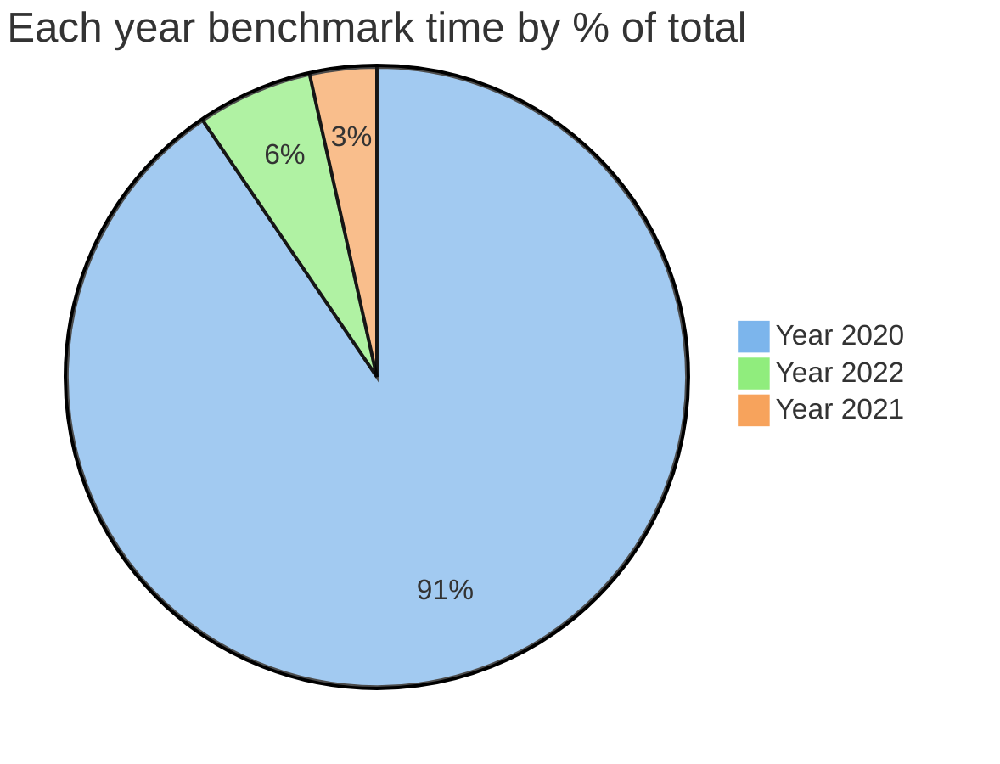
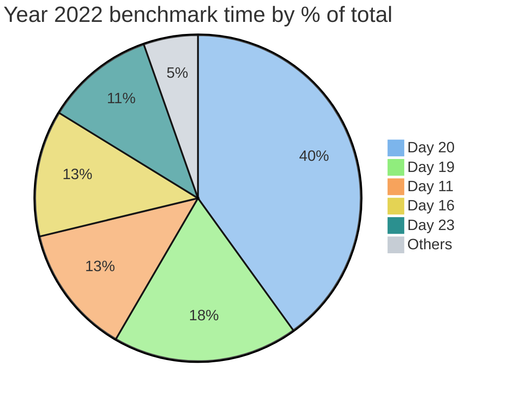
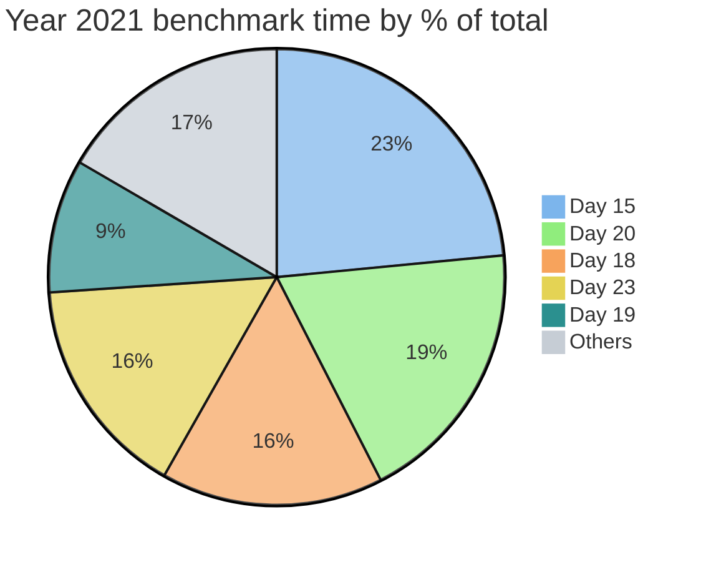
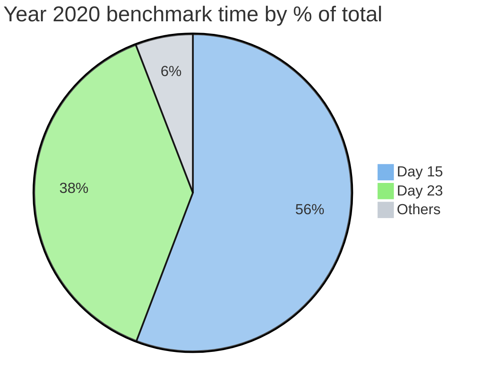

# Advent of Code

 

Complete 2022 to 2020 entries for the annual [Advent of Code](https://adventofcode.com/) challenge, written in performant Rust.

Solutions depend only on the stable Rust Standard Library. The code tries it's best to stay clean and elegant, but the focus is on speed so if bit twiddling or mashing stuff into an array makes things faster, then all scruples are jettisoned!

Benchmarks are measured using the built-in `cargo bench` tool run on an Apple M2 Max. All 50 solutions from 2022 to 2021 complete sequentially in **30 milliseconds**. Performance is reasonable even on older hardware, for example a 2011 MacBook Pro with an [Intel i7-2720QM](https://ark.intel.com/content/www/us/en/ark/products/50067/intel-core-i72720qm-processor-6m-cache-up-to-3-30-ghz.html) processor takes 83 milliseconds to run all 50 solutions.

The project is structured as a library crate with a module per year and a sub-module for each day to allow convenient testing and benchmarking. Continuous integration is provided using [GitHub Actions](https://docs.github.com/en/actions) with test coverage based on the example inputs from each day.

Each solution is thoroughly commented to help explain the approach, browse the source or checkout the online [rustdocs](https://maneatingape.github.io/advent-of-code-rust/aoc/).

## Cargo commands

**Run**
* Everything `cargo run`
* Specific year `cargo run year2022`
* Specific day `cargo run year2022::day01`
* Release profile (faster) `cargo run --release`
* Optimized for current CPU architecture (fastest) `RUSTFLAGS="-C target-cpu=native" cargo run --release`

**Test**
* Everything `cargo test`
* Specific year `cargo test year2022`
* Specific day `cargo test year2022::day01`
* Show STDOUT for debugging `cargo test -- --nocapture`

**Benchmark**
* Everything `cargo bench`
* Specific year `cargo bench year2022`
* Specific day `cargo bench year2022::day01`

**Document**
* Build docs including private items `cargo doc --document-private-items`
* Build doc then open HTML landing page `cargo doc --document-private-items --open`

**Miscellaneous**
* Code quality lints `cargo clippy`
* Consistent code formatting `cargo fmt`

## Years

* [2022](#2022) (19 ms)
* [2021](#2021) (11 ms)
* [2020](#2020) (286 ms)
* [2015](#2015) (in progress)

## 2022

| Day | Problem | Solution | Benchmark (μs) |
| --- | --- | --- | --: |
| 1 | [Calorie Counting](https://adventofcode.com/2022/day/1) | [Source](src/year2022/day01.rs) | 14 |
| 2 | [Rock Paper Scissors](https://adventofcode.com/2022/day/2) | [Source](src/year2022/day02.rs) | 9 |
| 3 | [Rucksack Reorganization](https://adventofcode.com/2022/day/3) | [Source](src/year2022/day03.rs) | 15 |
| 4 | [Camp Cleanup](https://adventofcode.com/2022/day/4) | [Source](src/year2022/day04.rs) | 7 |
| 5 | [Supply Stacks](https://adventofcode.com/2022/day/5) | [Source](src/year2022/day05.rs) | 14 |
| 6 | [Tuning Trouble](https://adventofcode.com/2022/day/6) | [Source](src/year2022/day06.rs) | 6 |
| 7 | [No Space Left On Device](https://adventofcode.com/2022/day/7) | [Source](src/year2022/day07.rs) | 10 |
| 8 | [Treetop Tree House](https://adventofcode.com/2022/day/8) | [Source](src/year2022/day08.rs) | 55 |
| 9 | [Rope Bridge](https://adventofcode.com/2022/day/9) | [Source](src/year2022/day09.rs) | 115 |
| 10 | [Cathode-Ray Tube](https://adventofcode.com/2022/day/10) | [Source](src/year2022/day10.rs) | 2 |
| 11 | [Monkey in the Middle](https://adventofcode.com/2022/day/11) | [Source](src/year2022/day11.rs) | 2386 |
| 12 | [Hill Climbing Algorithm](https://adventofcode.com/2022/day/12) | [Source](src/year2022/day12.rs) | 59 |
| 13 | [Distress Signal](https://adventofcode.com/2022/day/13) | [Source](src/year2022/day13.rs) | 16 |
| 14 | [Regolith Reservoir](https://adventofcode.com/2022/day/14) | [Source](src/year2022/day14.rs) | 205 |
| 15 | [Beacon Exclusion Zone](https://adventofcode.com/2022/day/15) | [Source](src/year2022/day15.rs) | 2 |
| 16 | [Proboscidea Volcanium](https://adventofcode.com/2022/day/16) | [Source](src/year2022/day16.rs) | 2331 |
| 17 | [Pyroclastic Flow](https://adventofcode.com/2022/day/17) | [Source](src/year2022/day17.rs) | 68 |
| 18 | [Boiling Boulders](https://adventofcode.com/2022/day/18) | [Source](src/year2022/day18.rs) | 129 |
| 19 | [Not Enough Minerals](https://adventofcode.com/2022/day/19) | [Source](src/year2022/day19.rs) | 3416 |
| 20 | [Grove Positioning System](https://adventofcode.com/2022/day/20) | [Source](src/year2022/day20.rs) | 7449 |
| 21 | [Monkey Math](https://adventofcode.com/2022/day/21) | [Source](src/year2022/day21.rs) | 61 |
| 22 | [Monkey Map](https://adventofcode.com/2022/day/22) | [Source](src/year2022/day22.rs) | 132 |
| 23 | [Unstable Diffusion](https://adventofcode.com/2022/day/23) | [Source](src/year2022/day23.rs) | 2017 |
| 24 | [Blizzard Basin](https://adventofcode.com/2022/day/24) | [Source](src/year2022/day24.rs) | 80 |
| 25 | [Full of Hot Air](https://adventofcode.com/2022/day/25) | [Source](src/year2022/day25.rs) | 3 |

## 2021

| Day | Problem | Solution | Benchmark (μs) |
| --- | --- | --- | --: |
| 1 | [Sonar Sweep](https://adventofcode.com/2021/day/1) | [Source](src/year2021/day01.rs) | 6 |
| 2 | [Dive!](https://adventofcode.com/2021/day/2) | [Source](src/year2021/day02.rs) | 11 |
| 3 | [Binary Diagnostic](https://adventofcode.com/2021/day/3) | [Source](src/year2021/day03.rs) | 20 |
| 4 | [Giant Squid](https://adventofcode.com/2021/day/4) | [Source](src/year2021/day04.rs) | 11 |
| 5 | [Hydrothermal Venture](https://adventofcode.com/2021/day/5) | [Source](src/year2021/day05.rs) | 179 |
| 6 | [Lanternfish](https://adventofcode.com/2021/day/6) | [Source](src/year2021/day06.rs) | 1 |
| 7 | [The Treachery of Whales](https://adventofcode.com/2021/day/7) | [Source](src/year2021/day07.rs) | 1 |
| 8 | [Seven Segment Search](https://adventofcode.com/2021/day/8) | [Source](src/year2021/day08.rs) | 16 |
| 9 | [Smoke Basin](https://adventofcode.com/2021/day/9) | [Source](src/year2021/day09.rs) | 55 |
| 10 | [Syntax Scoring](https://adventofcode.com/2021/day/10) | [Source](src/year2021/day10.rs) | 33 |
| 11 | [Dumbo Octopus](https://adventofcode.com/2021/day/11) | [Source](src/year2021/day11.rs) | 58 |
| 12 | [Passage Pathing](https://adventofcode.com/2021/day/12) | [Source](src/year2021/day12.rs) | 27 |
| 13 | [Transparent Origami](https://adventofcode.com/2021/day/13) | [Source](src/year2021/day13.rs) | 32 |
| 14 | [Extended Polymerization](https://adventofcode.com/2021/day/14) | [Source](src/year2021/day14.rs) | 12 |
| 15 | [Chiton](https://adventofcode.com/2021/day/15) | [Source](src/year2021/day15.rs) | 2567 |
| 16 | [Packet Decoder](https://adventofcode.com/2021/day/16) | [Source](src/year2021/day16.rs) | 5 |
| 17 | [Trick Shot](https://adventofcode.com/2021/day/17) | [Source](src/year2021/day17.rs) | 7 |
| 18 | [Snailfish](https://adventofcode.com/2021/day/18) | [Source](src/year2021/day18.rs) | 1723 |
| 19 | [Beacon Scanner](https://adventofcode.com/2021/day/19) | [Source](src/year2021/day19.rs) | 1034 |
| 20 | [Trench Map](https://adventofcode.com/2021/day/20) | [Source](src/year2021/day20.rs) | 2075 |
| 21 | [Dirac Dice](https://adventofcode.com/2021/day/21) | [Source](src/year2021/day21.rs) | 282 |
| 22 | [Reactor Reboot](https://adventofcode.com/2021/day/22) | [Source](src/year2021/day22.rs) | 398 |
| 23 | [Amphipod](https://adventofcode.com/2021/day/23) | [Source](src/year2021/day23.rs) | 1717 |
| 24 | [Arithmetic Logic Unit](https://adventofcode.com/2021/day/24) | [Source](src/year2021/day24.rs) | 4 |
| 25 | [Sea Cucumber](https://adventofcode.com/2021/day/25) | [Source](src/year2021/day25.rs) | 621 |

## 2020

| Day | Problem | Solution | Benchmark (μs) |
| --- | --- | --- | --: |
| 1 | [Report Repair](https://adventofcode.com/2020/day/1) | [Source](src/year2020/day01.rs) | 11 |
| 2 | [Password Philosophy](https://adventofcode.com/2020/day/2) | [Source](src/year2020/day02.rs) | 35 |
| 3 | [Toboggan Trajectory](https://adventofcode.com/2020/day/3) | [Source](src/year2020/day03.rs) | 11 |
| 4 | [Passport Processing](https://adventofcode.com/2020/day/4) | [Source](src/year2020/day04.rs) | 43 |
| 5 | [Binary Boarding](https://adventofcode.com/2020/day/5) | [Source](src/year2020/day05.rs) | 12 |
| 6 | [Custom Customs](https://adventofcode.com/2020/day/6) | [Source](src/year2020/day06.rs) | 35 |
| 7 | [Handy Haversacks](https://adventofcode.com/2020/day/7) | [Source](src/year2020/day07.rs) | 89 |
| 8 | [Handheld Halting](https://adventofcode.com/2020/day/8) | [Source](src/year2020/day08.rs) | 7 |
| 9 | [Encoding Error](https://adventofcode.com/2020/day/9) | [Source](src/year2020/day09.rs) | 9 |
| 10 | [Adapter Array](https://adventofcode.com/2020/day/10) | [Source](src/year2020/day10.rs) | 1 |
| 11 | [Seating System](https://adventofcode.com/2020/day/11) | [Source](src/year2020/day11.rs) | 4847 |
| 12 | [Rain Risk](https://adventofcode.com/2020/day/12) | [Source](src/year2020/day12.rs) | 11 |
| 13 | [Shuttle Search](https://adventofcode.com/2020/day/13) | [Source](src/year2020/day13.rs) | 1 |
| 14 | [Docking Data](https://adventofcode.com/2020/day/14) | [Source](src/year2020/day14.rs) | 79 |
| 15 | [Rambunctious Recitation](https://adventofcode.com/2020/day/15) | [Source](src/year2020/day15.rs) | 160000 |
| 16 | [Ticket Translation](https://adventofcode.com/2020/day/16) | [Source](src/year2020/day16.rs) | 102 |
| 17 | [Conway Cubes](https://adventofcode.com/2020/day/17) | [Source](src/year2020/day17.rs) | 414 |
| 18 | [Operation Order](https://adventofcode.com/2020/day/18) | [Source](src/year2020/day18.rs) | 141 |
| 19 | [Monster Messages](https://adventofcode.com/2020/day/19) | [Source](src/year2020/day19.rs) | 384 |
| 20 | [Jurassic Jigsaw](https://adventofcode.com/2020/day/20) | [Source](src/year2020/day20.rs) | 43 |
| 21 | [Allergen Assessment](https://adventofcode.com/2020/day/21) | [Source](src/year2020/day21.rs) | 51 |
| 22 | [Crab Combat](https://adventofcode.com/2020/day/22) | [Source](src/year2020/day22.rs) | 6105 |
| 23 | [Crab Cups](https://adventofcode.com/2020/day/23) | [Source](src/year2020/day23.rs) | 110000 |
| 24 | [Lobby Layout](https://adventofcode.com/2020/day/24) | [Source](src/year2020/day24.rs) | 4346 |
| 25 | [Combo Breaker](https://adventofcode.com/2020/day/25) | [Source](src/year2020/day25.rs) | 24 |

## 2015

| Day | Problem | Solution | Benchmark (μs) |
| --- | --- | --- | --: |
| 1 | [Not Quite Lisp](https://adventofcode.com/2015/day/1) | [Source](src/year2015/day01.rs) | 2 |
| 2 | [I Was Told There Would Be No Math](https://adventofcode.com/2015/day/2) | [Source](src/year2015/day02.rs) | 8 |
| 3 | [Perfectly Spherical Houses in a Vacuum](https://adventofcode.com/2015/day/3) | [Source](src/year2015/day03.rs) | 100 |
| 4 | [The Ideal Stocking Stuffer](https://adventofcode.com/2015/day/4) | [Source](src/year2015/day04.rs) | 858000 |
| 5 | [Doesn't He Have Intern-Elves For This?](https://adventofcode.com/2015/day/5) | [Source](src/year2015/day05.rs) | 39 |
| 6 | [Probably a Fire Hazard](https://adventofcode.com/2015/day/6) | [Source](src/year2015/day06.rs) | 5780 |
| 7 | [Some Assembly Required](https://adventofcode.com/2015/day/7) | [Source](src/year2015/day07.rs) | 27 |
| 8 | [Matchsticks](https://adventofcode.com/2015/day/8) | [Source](src/year2015/day08.rs) | 12 |
| 9 | [All in a Single Night](https://adventofcode.com/2015/day/9) | [Source](src/year2015/day09.rs) | 35 |
| 10 | [Elves Look, Elves Say](https://adventofcode.com/2015/day/10) | [Source](src/year2015/day10.rs) | 14 |
